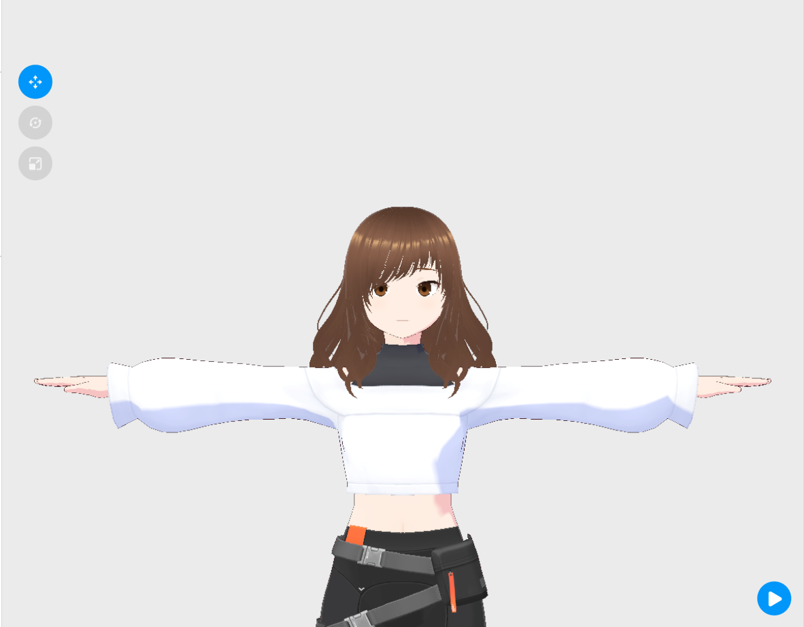
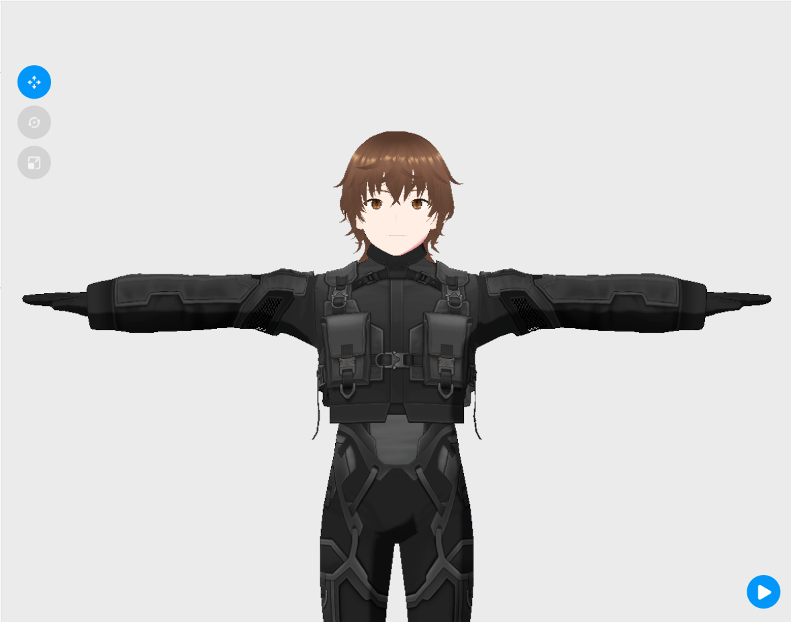

# VORA Avatar Models

This repository contains the **3D avatar assets** used in the VORA ecosystem.  
Each avatar was created in **VRoid Studio** and exported in **VRM format** for integration with applications that support humanoid avatars.

---

## Avatars

### IRA

  

**IRA** is a humanoid avatar designed as part of the VORA digital companion system.

**Files**

- `IRA.vrm` — Exported VRM avatar used in compatible engines and applications.
- `IRA_model.vroid` — Original VRoid Studio project file used to design and modify the avatar.

---

### AIRIN

  

**AIRIN** is another avatar created for the VORA environment.

**Files**

- `AIRIN.vrm` — Exported VRM avatar model.
- `AIRIN_model.vroid` — Editable VRoid Studio project file.

---

## File Formats

| Format | Description |
|------|-------------|
| `.vrm` | Standard format for humanoid 3D avatars used in VR/AR applications and game engines. |
| `.vroid` | Project file used by **VRoid Studio** for creating and editing avatars. |

---
